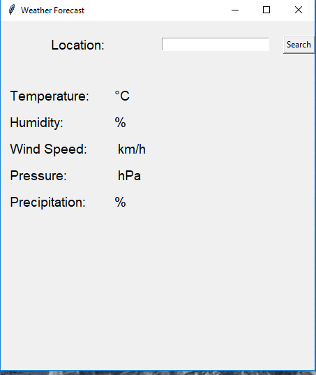

<h1 align="center">🌦️ Weather Forecast App — Python & Tkinter</h1>

  A simple and responsive desktop GUI app that fetches live weather data from the <a href="https://openweathermap.org/api" target="_blank">OpenWeather API</a>.  
  Made with <strong>Python</strong> and <strong>Tkinter</strong> — ideal for beginners!

python weather_forecast.py
<h2>📸 Screenshot</h2>  
 

---

<h2>🌐 Features</h2>

<ul>
  <li>Get real-time weather data by entering a city name</li>
  <li>Displays: Temperature, Humidity, Wind Speed, Pressure & Precipitation</li>
  <li>Responsive layout using Tkinter grid system</li>
  <li>Built-in error handling for invalid input and API issues</li>
</ul>

---

<h2> How It Works</h2>

<ol>
  <li>Uses <code>requests</code> to send an API call to OpenWeather</li>
  <li>Parses the JSON response</li>
  <li>Extracts and displays:
    <ul>
      <li>Temperature in Celsius</li>
      <li>Humidity (%)</li>
      <li>Wind Speed (km/h)</li>
      <li>Pressure (hPa)</li>
      <li>Main Weather Condition (e.g. Rain, Clouds)</li>
    </ul>
  </li>
</ol>

---

<h2> How to Run</h2>

<strong> Requirements</strong>

- Python 3.x  
- `requests` module  
- Internet connection  

<strong> Install Dependencies</strong>

pip install requests

<strong> Run the Script</strong>

<h2> Technologies Used</h2>
<ul>
 <li> Python 3</li>
<li> Tkinter — GUI development</li>
<li> requests — For API calls</li>
<li> OpenWeather API — Real-time weather data</li>
 </ul>
 
<h3>👨‍💻 Author</h3> 
Made by Youssef Talaat

